# 画面テスト結果（React 版・実行記録）

> **この紙は生成物です。** `tests/screen/shots-web.mjs` が実際にブラウザで画面を
> 開いて撮っています（手で直さない）。作り直し: `bash tools/run-tests.sh`

> **Flutter 版の紙（`出力-画面テスト結果.md`）と並べて読んでください。**
> 同じ定義・同じ API を、描く側だけ変えて出しています。項番の中身がそろって
> いれば「Renderer を差し替えても案件は変わらない」が本当だったということです。

> **撮る道具は Vue 版と React 版で同じ1本です**（2つの Renderer は同じ印を
> 出すと決めてあるので）。頭文字だけ変えています。

> **スクショは証拠であって、判定ではありません。** 値の合否は `hatake run`、
> サーバの合否は API テストが持っています。

- 実行日時: 2026-10-05T02:29:34.370Z
- 対象: `http://web-react:80`
- 画面の大きさ: 1600 x 900
- 前提: `docker compose up` で初期データの状態

## まとめ（12 / 12 枚）

| 項番 | 内容 | 役割 | 撮影 |
|---|---|---|---|
| R-01 | 条件の組み合わせ（all / any / not）と既定値 | tester | 撮れた |
| R-02 | 押す前に聞く・区切って実行・行の有効条件 | tester | 撮れた |
| R-03 | 選んだ件数がボタンに出る | tester | 撮れた |
| R-04 | 押す前に聞く（prompt） | tester | 撮れた |
| R-05 | 選択肢の連動・ページ送りを切る | tester | 撮れた |
| R-06 | ウィザードのボタン・条件で飛ばすステップ | tester | 撮れた |
| R-07 | 畳み込みの並べ替え・打ち切り・明細 | tester | 撮れた |
| R-08 | 帳票の降順・持ち出しは admin だけ | admin | 撮れた |
| R-09 | 帳票（tester）＝持ち出しが出ない | tester | 撮れた |
| R-10 | 見せる相手で変わる（admin） | admin | 撮れた |
| R-11 | 見せる相手で変わる（tester） | tester | 撮れた |
| R-12 | カードの盛り合わせ（数・図・表） | admin | 撮れた |

---

### R-01 条件の組み合わせ（all / any / not）と既定値

- **役割**: tester
- **確かめたいこと**: 組み合わせ条件が Vue でも同じに効くか
- **目で見て確かめること**: 種別に「標準」が最初から入っている（defaultValue）。標準なので「標準でないときだけ」の欄は出ていない

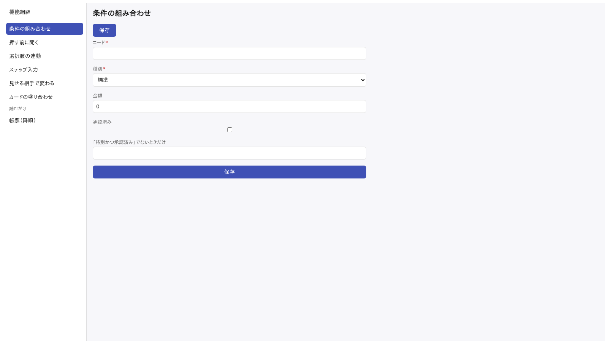

### R-02 押す前に聞く・区切って実行・行の有効条件

- **役割**: tester
- **確かめたいこと**: `actions:` が3スコープとも描かれているか（0.9.19 で入った所）
- **目で見て確かめること**: 題の右に一括が2つ出ていて、**1行も選んでいないので押せない**（札に「（行を選んでください）」）。行の「詳細」は試用の行だけ灰色。左端に選ぶ列が在る。種別は札で出る

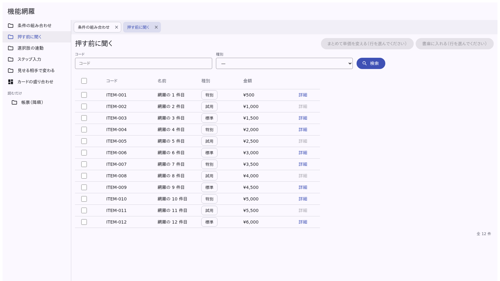

### R-03 選んだ件数がボタンに出る

- **役割**: tester
- **確かめたいこと**: 「3件のつもりが30件」を押す前に目で見られるか
- **目で見て確かめること**: ボタンが「まとめて単価を変える（12 件）」になり、**maxRows 10 を超えているので押せない**（書庫に入れるは押せる）

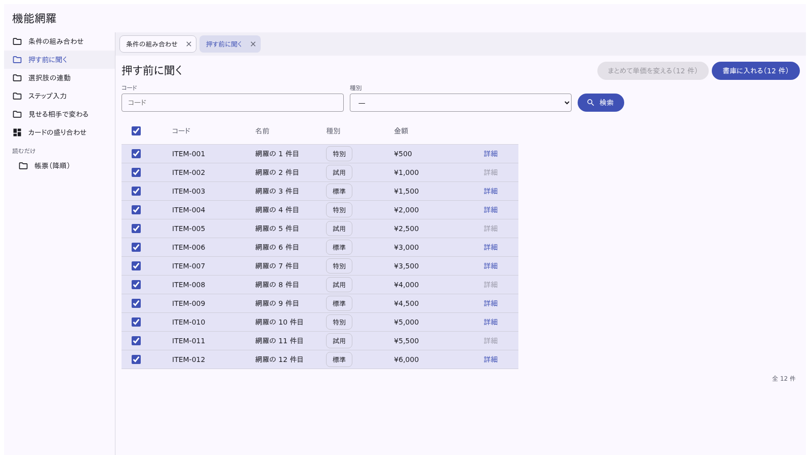

### R-04 押す前に聞く（prompt）

- **役割**: tester
- **確かめたいこと**: `prompt.fields` がダイアログになり、`{count}` が題に埋まるか
- **目で見て確かめること**: 「7 件の単価を変える」という題で、単価と理由の2つを聞いている。OK は「変える」

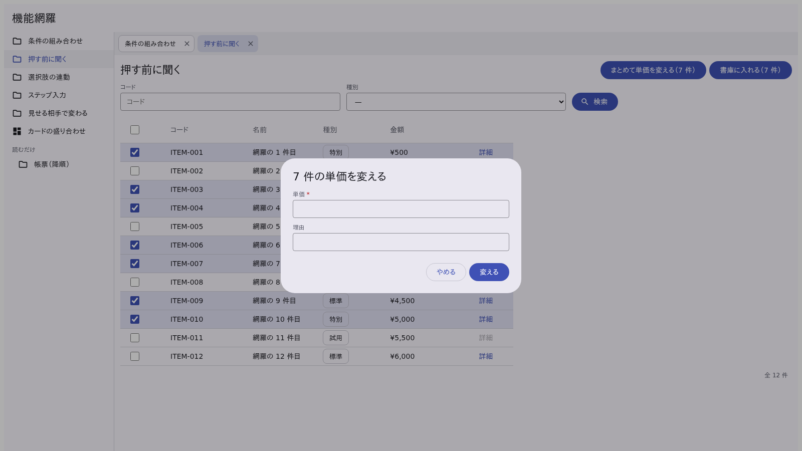

### R-05 選択肢の連動・ページ送りを切る

- **役割**: tester
- **確かめたいこと**: optionsSource.parentKey / limit / pagination.enabled
- **目で見て確かめること**: ページ送りが出ていない（全部載る）。グループの選択肢は API から来ている

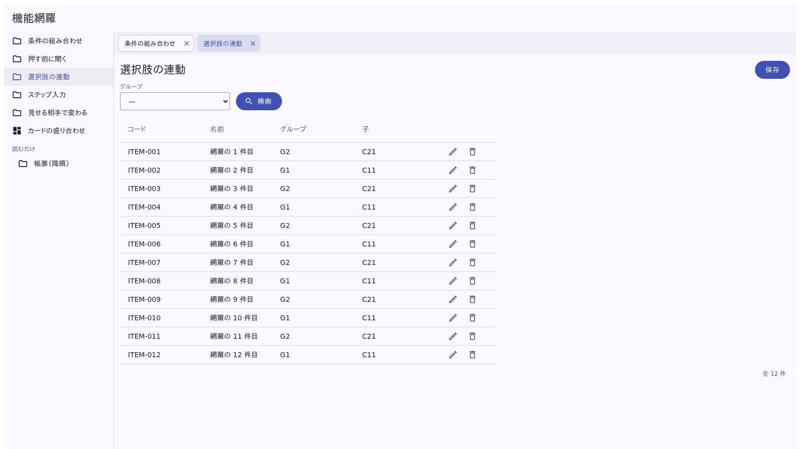

### R-06 ウィザードのボタン・条件で飛ばすステップ

- **役割**: tester
- **確かめたいこと**: `wizardPage.actions` が「戻る／次へ」とは別に出るか
- **目で見て確かめること**: ステップが出ていて、上に「保存」「やめる」、下に「戻る」「次へ」

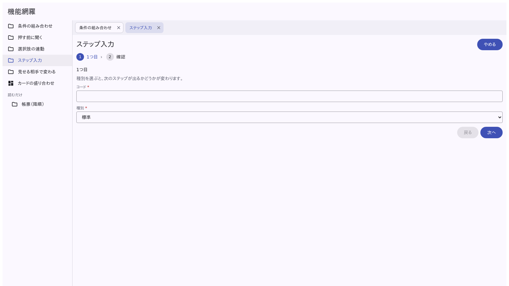

### R-07 畳み込みの並べ替え・打ち切り・明細

- **役割**: tester
- **確かめたいこと**: 行のボタンで開けるか、`computed` と `subTable` が描かれるか（両方 0.9.19 で入った）
- **目で見て確かめること**: 明細が**表**で出て金額が ¥ 付き。「金額の大きい順に3件」が大きい順、「合計」が明細の和

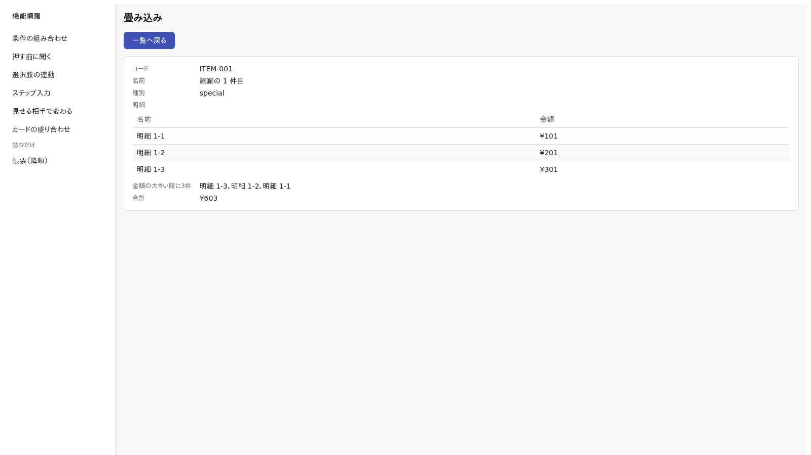

### R-08 帳票の降順・持ち出しは admin だけ

- **役割**: admin
- **確かめたいこと**: report.sort.ascending と、`print` を押すと**本当に PDF が落ちる**か
- **目で見て確かめること**: コードが**降順**（ITEM-012 が先頭）。「CSV 出力」「印刷」が出ている（撮る前に印刷を押している。PDF ができたかは道具が中身＝`%PDF-` で始まるかで確かめていて、できなければ撮らずに落とす）

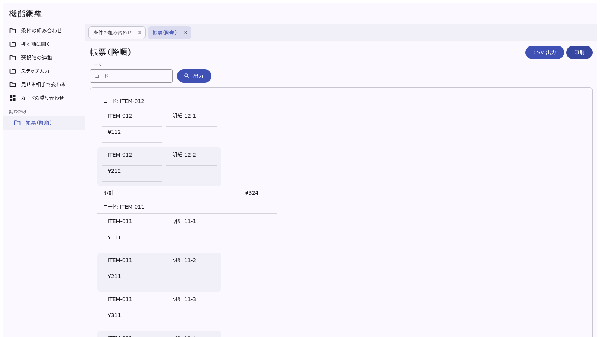

### R-09 帳票（tester）＝持ち出しが出ない

- **役割**: tester
- **確かめたいこと**: roles が効いているか
- **目で見て確かめること**: **「CSV 出力」「印刷」が出ていない**（V-08 との差）

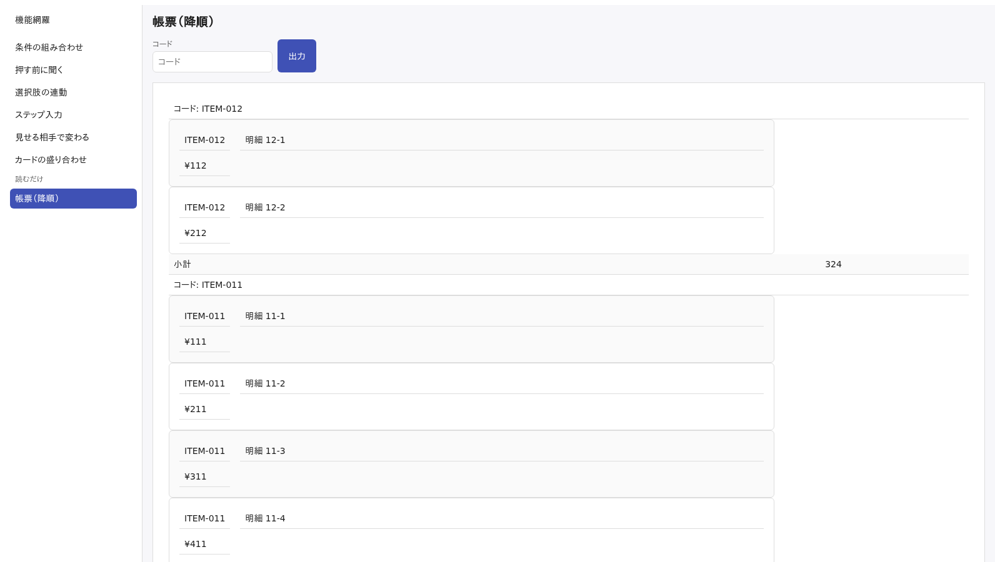

### R-10 見せる相手で変わる（admin）

- **役割**: admin
- **確かめたいこと**: 列・ボタン・項目の roles
- **目で見て確かめること**: 「原価」の列が出ている。「CSV 出力」が出ている。行の「編集」「削除」は絵のボタン（`rowActions` に書いたから出ている）

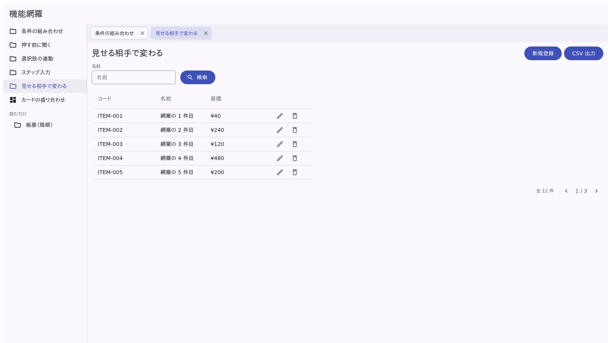

### R-11 見せる相手で変わる（tester）

- **役割**: tester
- **確かめたいこと**: roles が列とボタンの両方に効いているか
- **目で見て確かめること**: **「原価」の列が無い**。**「CSV 出力」も無い**（V-10 との差）

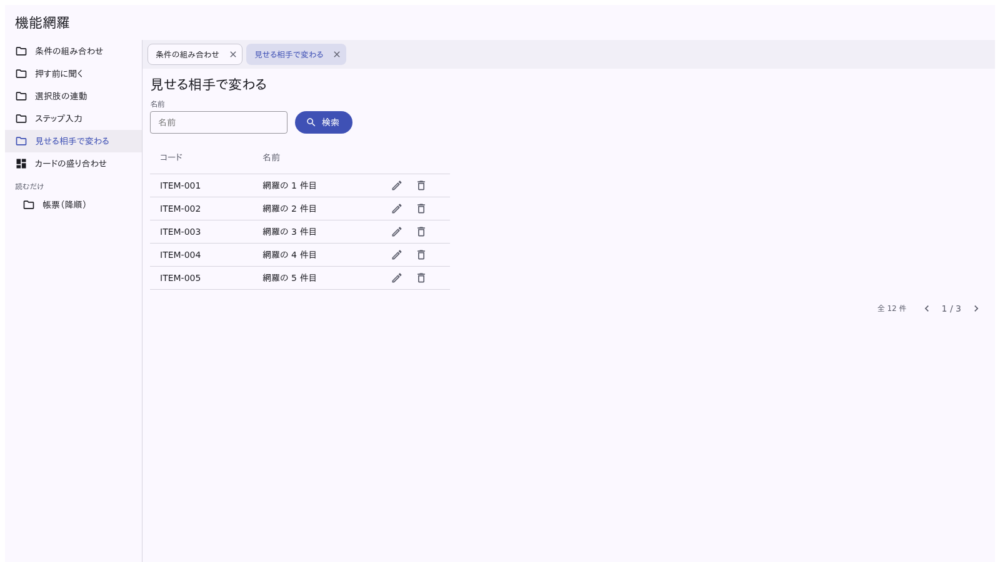

### R-12 カードの盛り合わせ（数・図・表）

- **役割**: admin
- **確かめたいこと**: dashboard のカード3種と span、カードごとの roles・固定条件
- **目で見て確かめること**: 1段目に件数・原価の合計・G1 だけ・平均原価の4枚（`layout.columns: 4`）、2段目に棒グラフと表（`span: 2`）。金額は ¥ 付き。admin なので「平均原価」が出ている

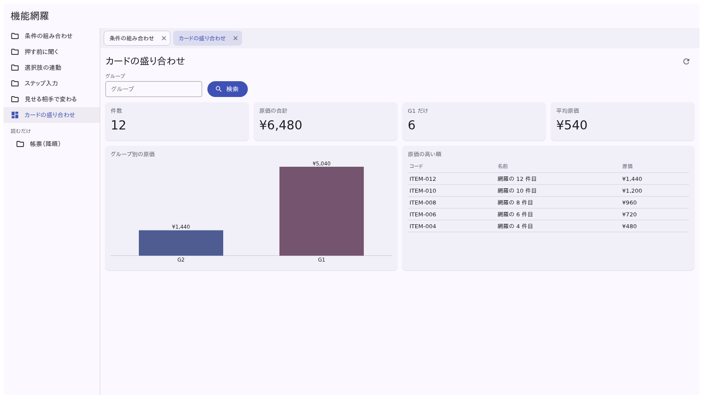
