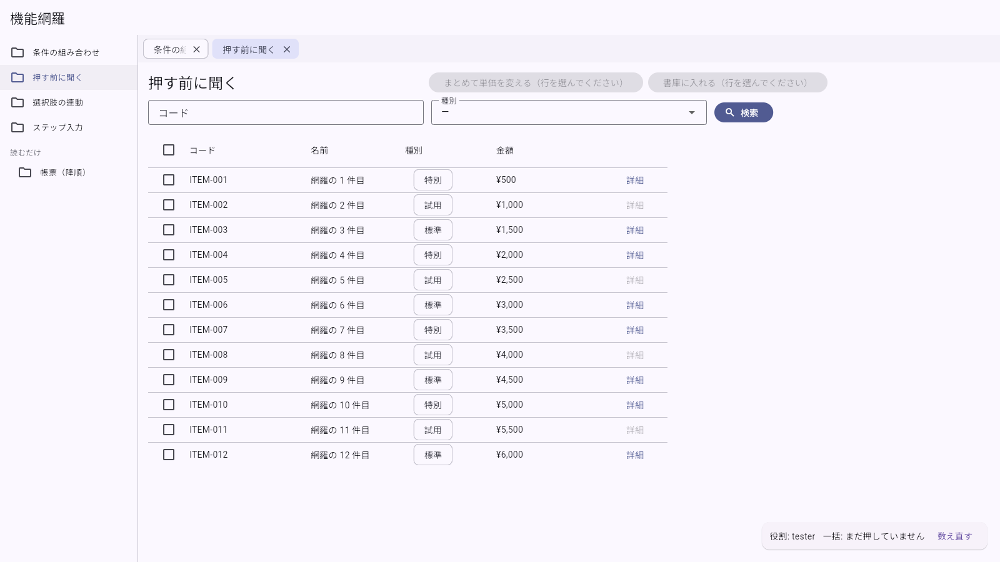
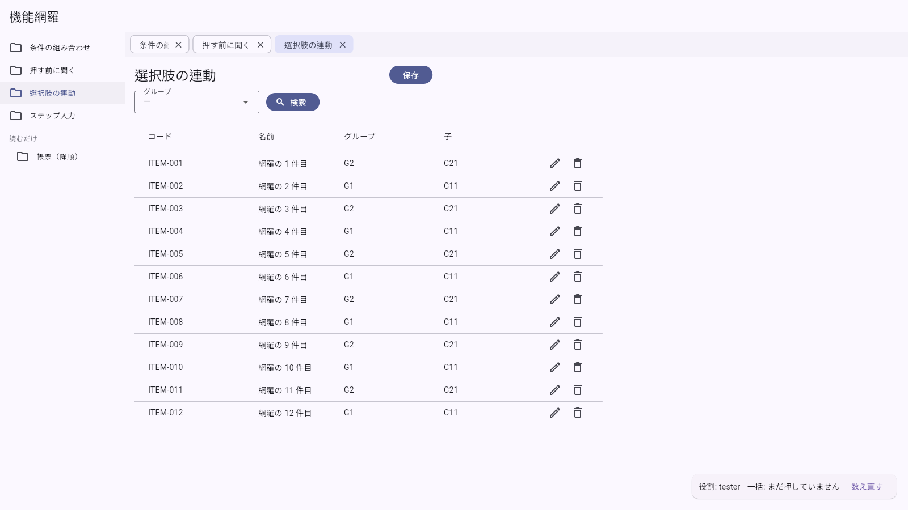
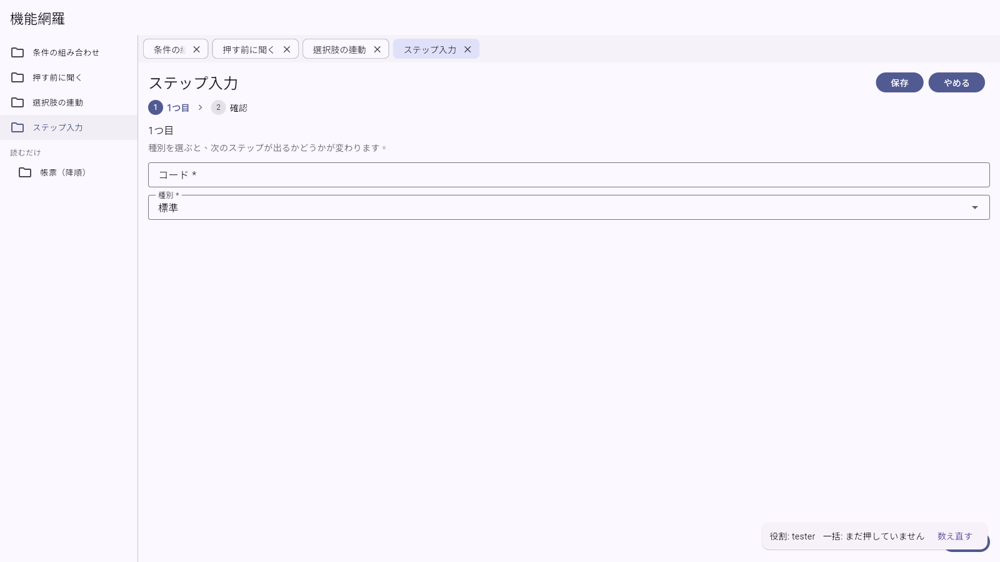
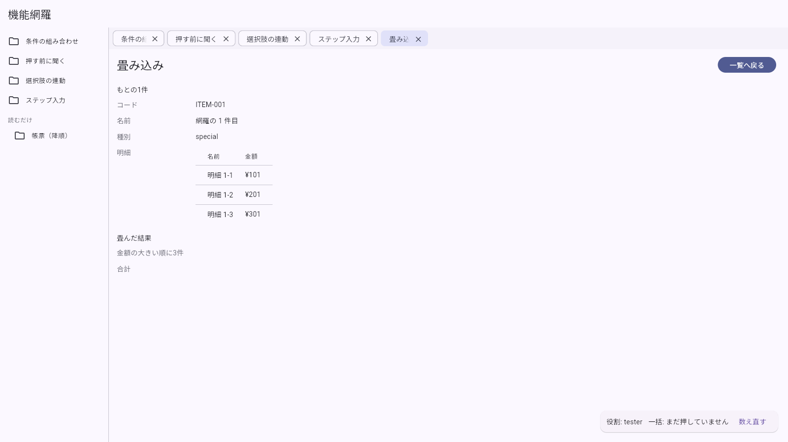
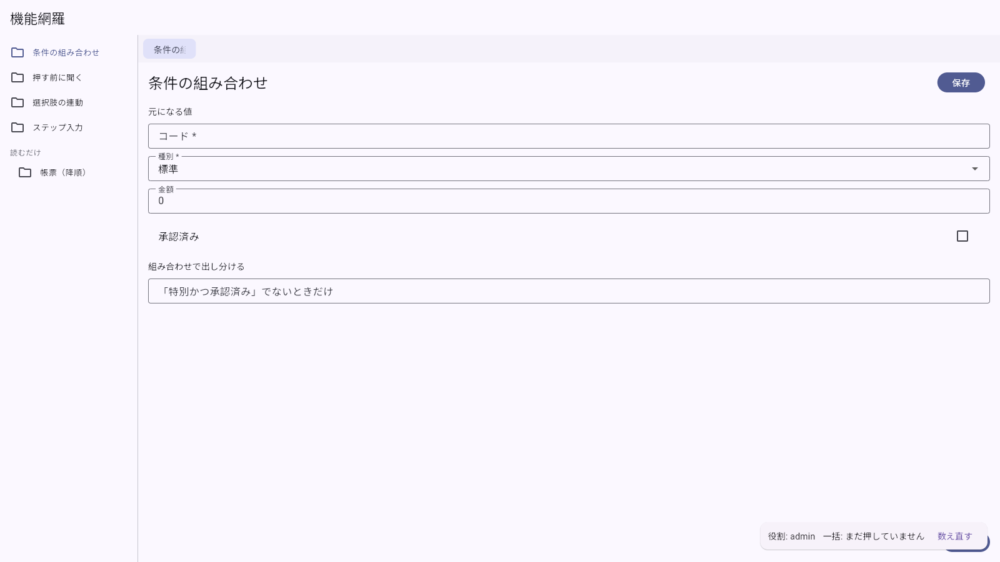
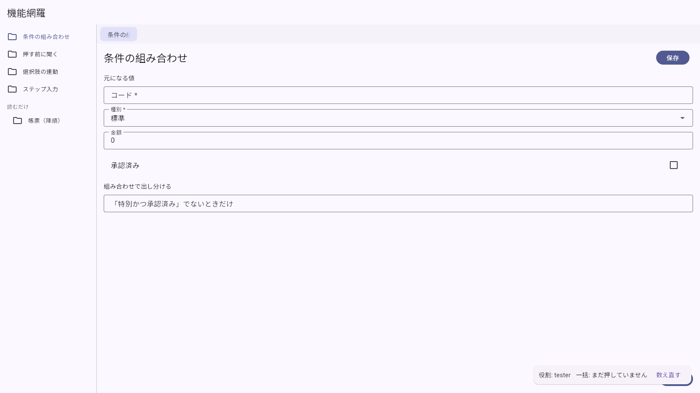

# 画面テスト結果（実行記録）

> **この紙は生成物です。** `tests/screen/shots.mjs` が実際にブラウザで画面を開いて
> 撮っています（手で直さない）。作り直し: `bash tools/run-tests.sh`

> **スクショは証拠であって、判定ではありません。** 画面の見た目を機械で合否にすると、
> 余白が1px 動いただけで落ちる紙になります。値の合否は `hatake run`（`出力-シナリオ結果.txt`）、
> サーバの合否は API テスト（`出力-APIテスト結果.md`）が持っていて、ここは
> **目で確かめて判子を押すための記録**です。

- 実行日時: 2026-09-25T08:45:18.668Z
- 対象: `http://web:80`
- 画面の大きさ: 1400 x 900
- 前提: `docker compose up` で初期データの状態

## まとめ（7 / 7 枚）

| 項番 | 内容 | 役割 | 撮影 |
|---|---|---|---|
| C-01 | 条件の組み合わせ（all / any / not）と既定値 | tester | 撮れた |
| C-02 | 押す前に聞く・区切って実行 | tester | 撮れた |
| C-03 | 選択肢の連動・ページ送りを切る | tester | 撮れた |
| C-04 | ウィザードのボタン・条件で飛ばすステップ | tester | 撮れた |
| C-05 | 畳み込みの並べ替え・打ち切り・詳細のボタン | tester | 撮れた |
| C-06 | 帳票の降順・持ち出しは admin だけ | admin | 撮れた |
| C-07 | 帳票（tester）＝持ち出しが出ない | tester | 撮れた |

---

### C-01 条件の組み合わせ（all / any / not）と既定値

- **役割**: tester
- **確かめたいこと**: 組み合わせ条件はどの例にも書かれていなかった所
- **目で見て確かめること**: 種別に「標準」が最初から入っている（defaultValue）。標準なので「標準でないときだけ」の欄は出ていない

### C-02 押す前に聞く・区切って実行

- **役割**: tester
- **確かめたいこと**: prompt / batchSize / enabledWhen / open はどの例にも無かった
- **目で見て確かめること**: 条件2つと一覧。行の「詳細」は試用の行では押せない。一括のボタンが2つ出ている

### C-03 選択肢の連動・ページ送りを切る

- **役割**: tester
- **確かめたいこと**: optionsSource.parentKey / limit / pagination.enabled はどの例にも無かった
- **目で見て確かめること**: ページ送りが出ていない（全部載る）。グループの選択肢は API から来ている

### C-04 ウィザードのボタン・条件で飛ばすステップ

- **役割**: tester
- **確かめたいこと**: wizardPage.actions はどの例にも無かった
- **目で見て確かめること**: ステップが出ていて、下に「保存」と「やめる」が出ている

### C-05 畳み込みの並べ替え・打ち切り・詳細のボタン

- **役割**: tester
- **確かめたいこと**: computed.sort / overflow / detailPage.actions はどの例にも無かった
- **目で見て確かめること**: 「金額の大きい順に3件」が**大きい順**に並び、4本以上ある件では「ほか N 件」が付く

### C-06 帳票の降順・持ち出しは admin だけ

- **役割**: admin
- **確かめたいこと**: report.sort.ascending はどの例にも無かった
- **目で見て確かめること**: コードが**降順**（ITEM-012 が先頭）。「CSV 出力」「印刷」が出ている

### C-07 帳票（tester）＝持ち出しが出ない

- **役割**: tester
- **確かめたいこと**: roles が効いているか
- **目で見て確かめること**: **「CSV 出力」「印刷」が出ていない**（C-06 との差）

