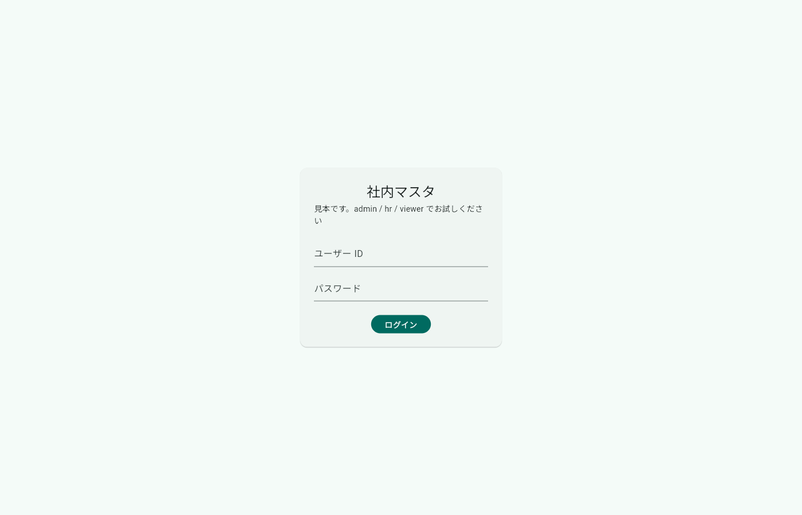
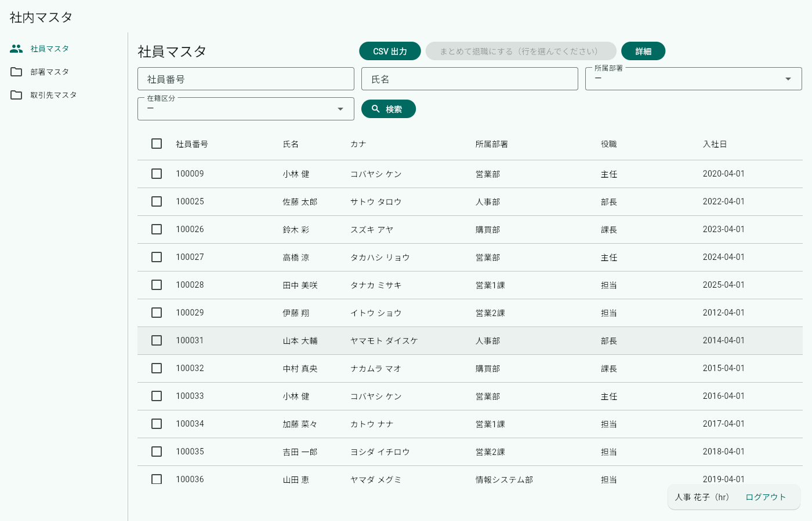
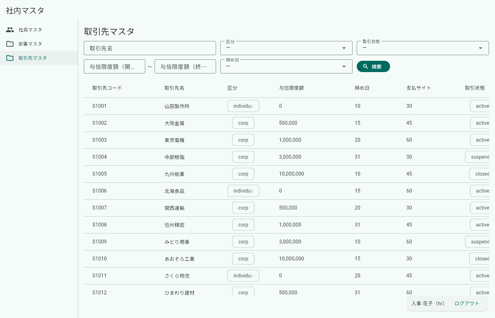
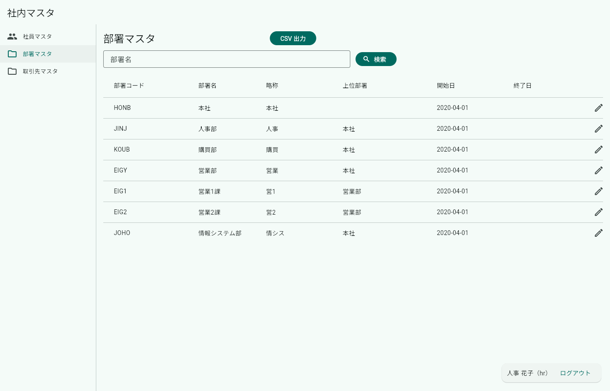
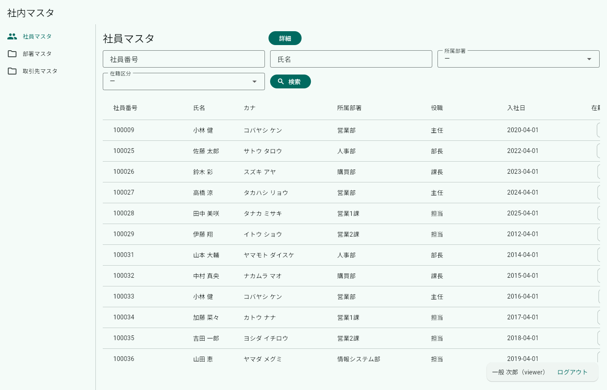
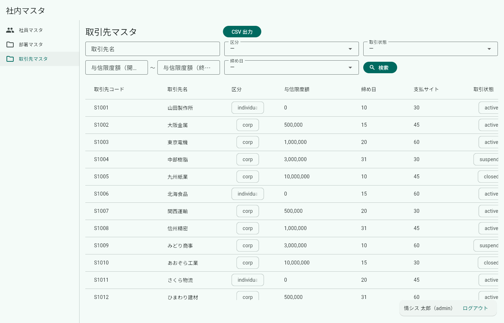

# 画面テスト結果（実行記録）

> **この紙は生成物です。** `tests/screen/shots.mjs` が実際にブラウザで画面を開いて
> 撮っています（手で直さない）。作り直し: `bash tools/run-tests.sh`

> **スクショは証拠であって、判定ではありません。** 画面の見た目を機械で合否にすると、
> 余白が1px 動いただけで落ちる紙になります。値の合否は `hatake run`（`出力-シナリオ結果.txt`）、
> サーバの合否は API テスト（`出力-APIテスト結果.md`）が持っていて、ここは
> **目で確かめて判子を押すための記録**です。

- 実行日時: 2026-09-17T02:37:14.192Z
- 対象: `http://web:80`
- 画面の大きさ: 1400 x 900
- 前提: `docker compose up` で初期データの状態

## まとめ（6 / 6 枚）

| 項番 | 内容 | 役割 | 撮影 |
|---|---|---|---|
| G-01 | ログイン画面が出る | （未ログイン） | 撮れた |
| G-02 | 社員マスタ（人事） | hr | 撮れた |
| G-03 | 取引先マスタ（人事）＝複雑な検索 | hr | 撮れた |
| G-04 | 部署マスタ（人事） | hr | 撮れた |
| G-05 | 社員マスタ（一般）＝見えないものがある | viewer | 撮れた |
| G-06 | 取引先マスタ（情シス）＝人事との違い | admin | 撮れた |

---

### G-01 ログイン画面が出る

- **役割**: （未ログイン）
- **確かめたいこと**: 認証は枠組みの外なので、この画面だけ手で書いてある
- **目で見て確かめること**: ID とパスワードの欄・ログインボタンが出ている

### G-02 社員マスタ（人事）

- **役割**: hr
- **確かめたいこと**: 定義1枚から、検索・一覧・ボタンが全部出る
- **目で見て確かめること**: 検索4条件／一覧8列／「CSV 出力」「まとめて退職にする」「詳細」が出ている

### G-03 取引先マスタ（人事）＝複雑な検索

- **役割**: hr
- **確かめたいこと**: 範囲（between）と複数選択（in）が定義から出る
- **目で見て確かめること**: 与信限度額の「以上／以下」と締め日の複数選択が出ている。**CSV 出力は出ない**（定義で admin だけ）

### G-04 部署マスタ（人事）

- **役割**: hr
- **確かめたいこと**: 自分自身を選択肢に使う（上位部署）
- **目で見て確かめること**: 部署コード・部署名・上位部署の列が出ている

### G-05 社員マスタ（一般）＝見えないものがある

- **役割**: viewer
- **確かめたいこと**: 定義の `roles` が効いているか
- **目で見て確かめること**: **「CSV 出力」「まとめて退職にする」が消え、選択のチェックボックスも無い**。内線の列も無い

### G-06 取引先マスタ（情シス）＝人事との違い

- **役割**: admin
- **確かめたいこと**: 同じ画面でも役割で出るものが変わる
- **目で見て確かめること**: G-03 では出なかった**「CSV 出力」が出ている**

