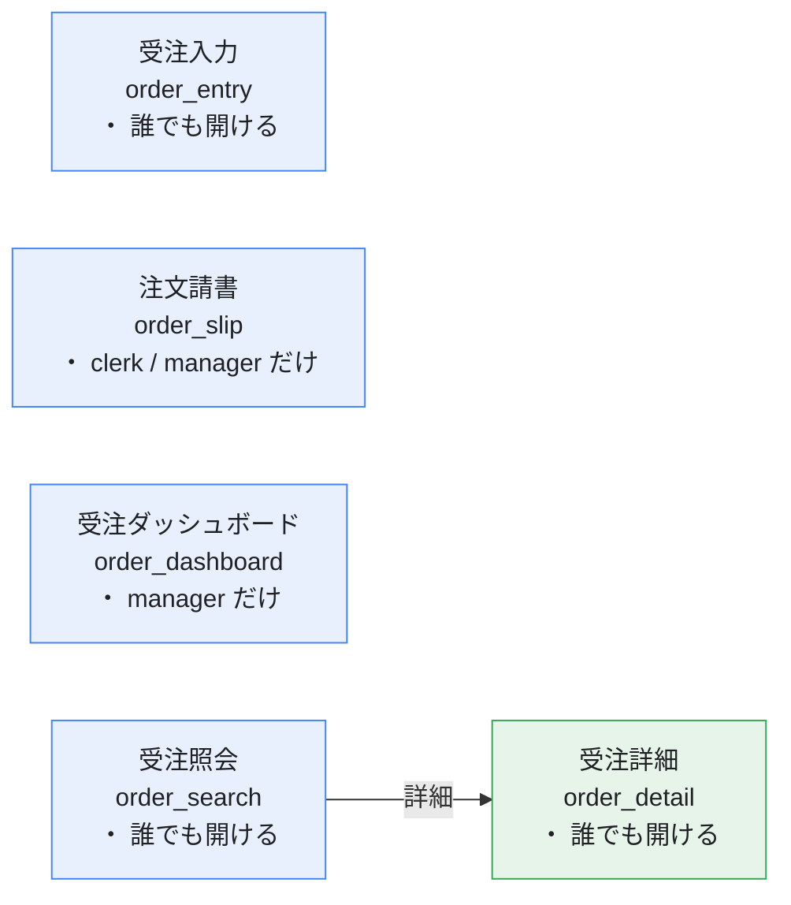

# 画面遷移図

> **この紙は生成物です。** `tools/build-design-docs.mjs` が
> [定義](../../definitions/app.yaml)から起こしています（手で直さない）。
> 定義を直したら `node tools/build-design-docs.mjs` で作り直してください。
>
> **どの画面からどの画面へ行けるか**。箱の中は「誰が開けるか」。

同じ図の SVG: [画面遷移図.svg](画面遷移図.svg)

> 点線の箱は**誰も開けない画面**（入口の権限が食い違っている）、
> 赤枠は**誰でも開けて消す／持ち出せる画面**。どちらも定義から数えている。
