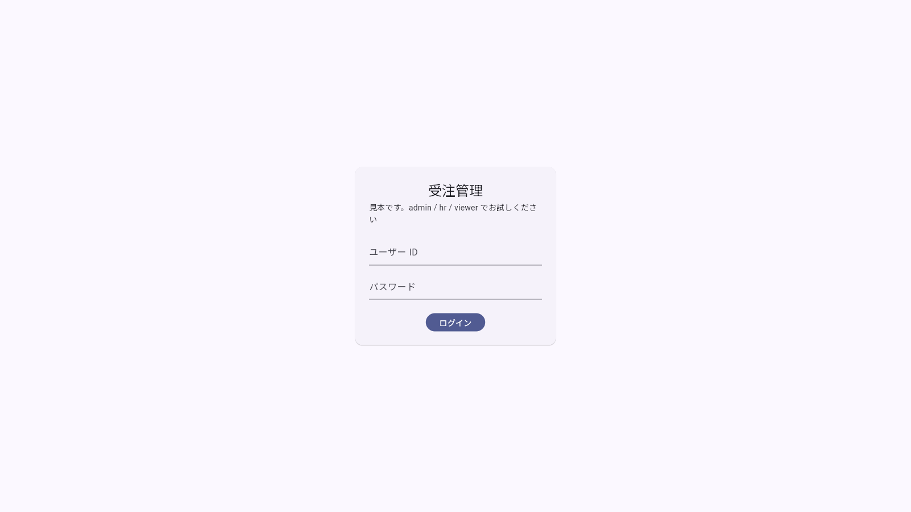
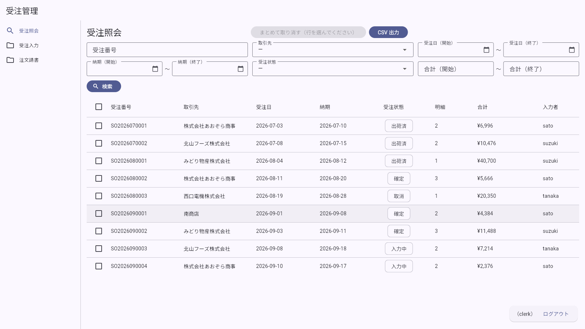
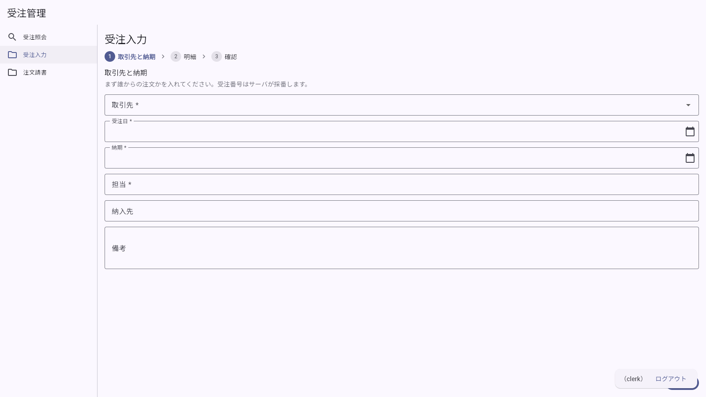
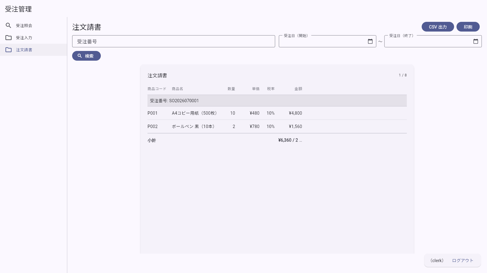
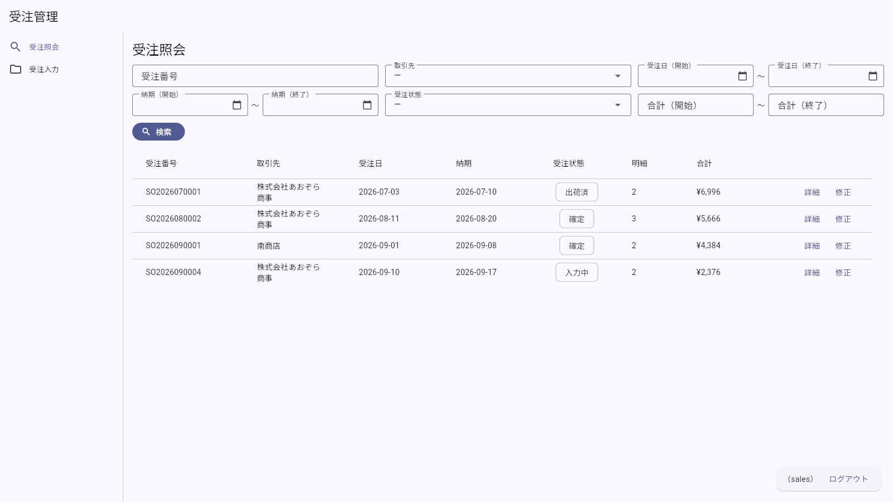
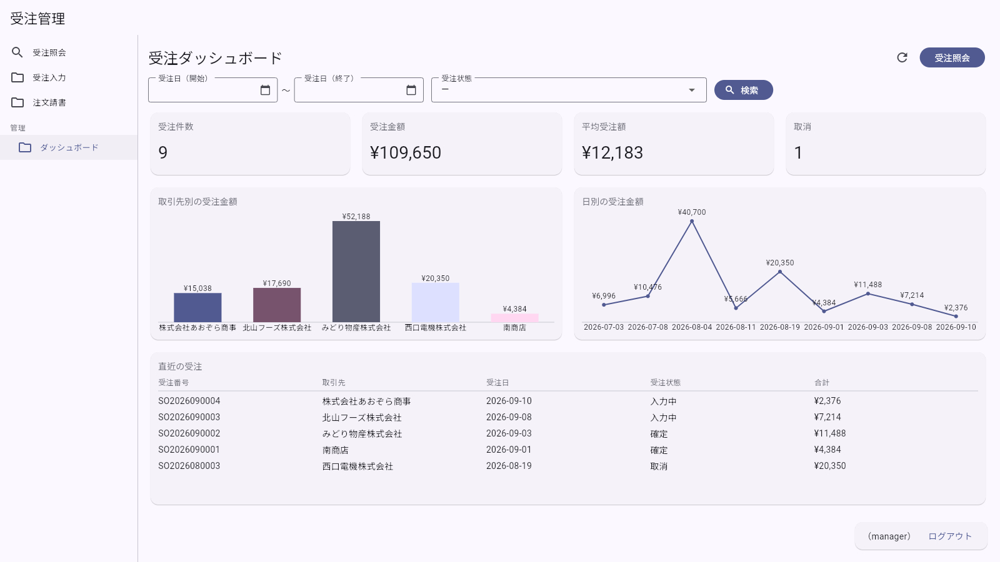
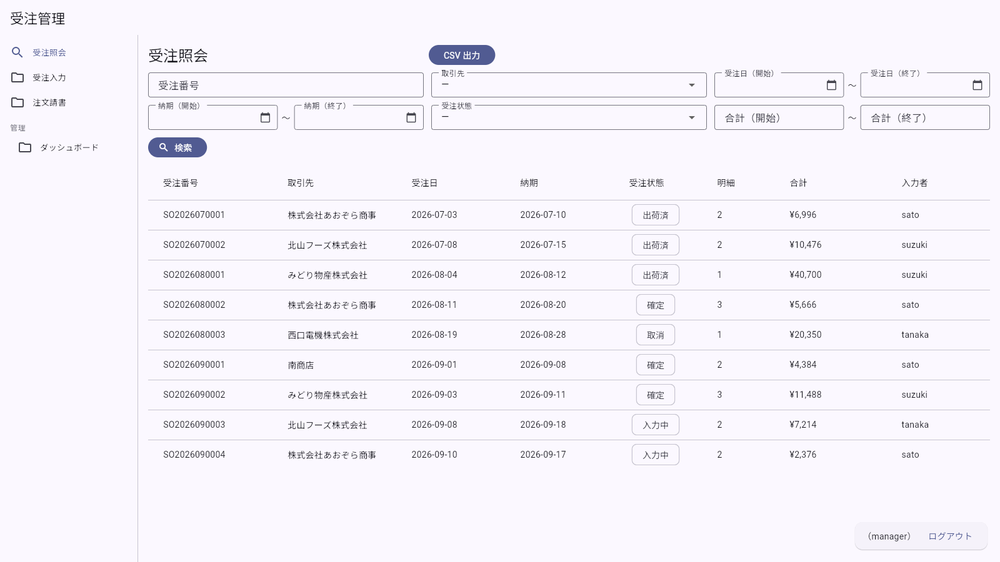

# 画面テスト結果（実行記録）

> **この紙は生成物です。** `tests/screen/shots.mjs` が実際にブラウザで画面を開いて
> 撮っています（手で直さない）。作り直し: `bash tools/run-tests.sh`

> **スクショは証拠であって、判定ではありません。** 画面の見た目を機械で合否にすると、
> 余白が1px 動いただけで落ちる紙になります。値の合否は `hatake run`（`出力-シナリオ結果.txt`）、
> サーバの合否は API テスト（`出力-APIテスト結果.md`）が持っていて、ここは
> **目で確かめて判子を押すための記録**です。

- 実行日時: 2026-09-18T00:40:46.294Z
- 対象: `http://web:80`
- 画面の大きさ: 1400 x 900
- 前提: `docker compose up` で初期データの状態

## まとめ（7 / 7 枚）

| 項番 | 内容 | 役割 | 撮影 |
|---|---|---|---|
| G-01 | ログイン画面が出る | （未ログイン） | 撮れた |
| G-02 | 受注照会（営業事務） | tanaka | 撮れた |
| G-03 | 受注入力（ステップ1: 取引先と納期） | tanaka | 撮れた |
| G-04 | 注文請書（帳票） | tanaka | 撮れた |
| G-05 | 受注照会（営業）＝見えないものがある | sato | 撮れた |
| G-06 | 受注ダッシュボード（管理者） | yamada | 撮れた |
| G-07 | 受注詳細（読み取り） | yamada | 撮れた |

---

### G-01 ログイン画面が出る

- **役割**: （未ログイン）
- **確かめたいこと**: 認証は枠組みの外なので、この画面だけ手で書いてある
- **目で見て確かめること**: ID とパスワードの欄・ログインボタンが出ている

### G-02 受注照会（営業事務）

- **役割**: tanaka
- **確かめたいこと**: 定義1枚から、検索・一覧・ボタンが全部出る
- **目で見て確かめること**: 検索6条件／一覧8列／「CSV 出力」「まとめて取り消す」「詳細」「修正」が出ている。**入力者の列が見えている**

### G-03 受注入力（ステップ1: 取引先と納期）

- **役割**: tanaka
- **確かめたいこと**: `type: wizard` は入力を段階に分ける。新人が迷わないように
- **目で見て確かめること**: ステップが3つ出ていて、1つ目だけが入力できる。取引先は取引先マスタから引いた選択肢

### G-04 注文請書（帳票）

- **役割**: tanaka
- **確かめたいこと**: 一覧の列がそのまま紙の列になる（画面と紙で列がずれない）
- **目で見て確かめること**: 出力条件（受注番号・受注日）と、明細の列が出ている。「CSV 出力」「印刷」が出ている

### G-05 受注照会（営業）＝見えないものがある

- **役割**: sato
- **確かめたいこと**: 定義の `roles` が効いているか。**本当の遮断はサーバ**（A-10 / A-11）
- **目で見て確かめること**: **「まとめて取り消す」「CSV 出力」が消え、入力者の列も無い**。メニューに「注文請書」「管理」が出ない

### G-06 受注ダッシュボード（管理者）

- **役割**: yamada
- **確かめたいこと**: 管理者だけがメニューから開ける（グループの `roles` が中身にも掛かる）
- **目で見て確かめること**: カードが7枚（件数・金額・平均・取消・取引先別・日別・直近）。ほかの役割ではメニューに出ない

### G-07 受注詳細（読み取り）

- **役割**: yamada
- **確かめたいこと**: 親子（ヘッダ＋明細）を1枚で読む画面
- **目で見て確かめること**: 受注情報・明細のグリッド・金額・履歴の4枠。すべて読み取りで、入力できない

