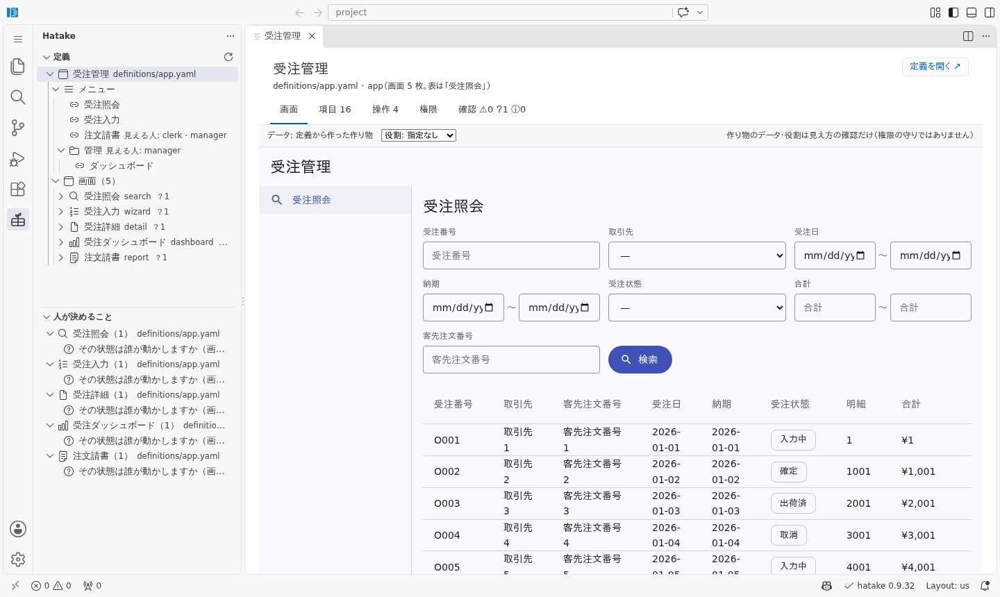
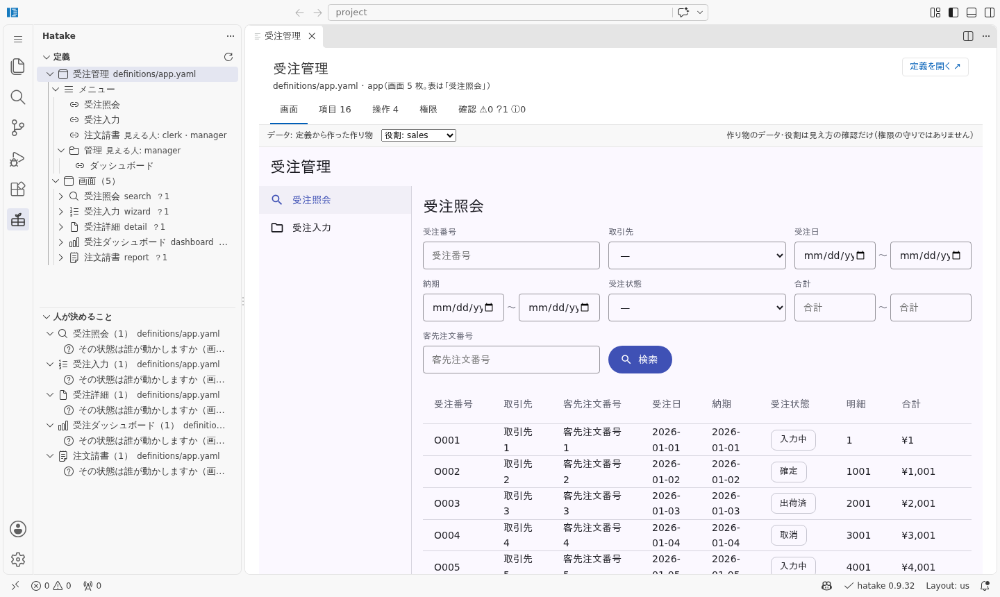
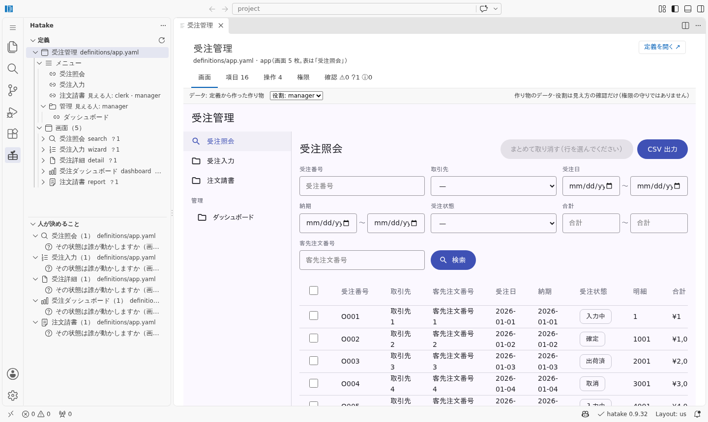
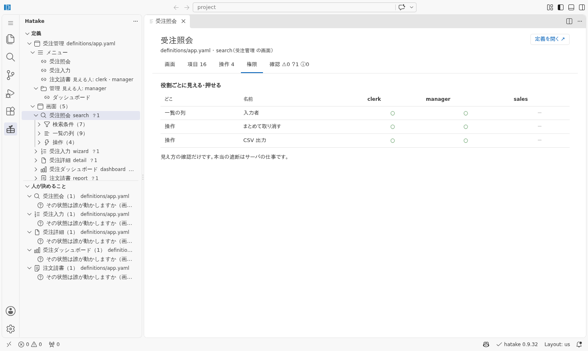
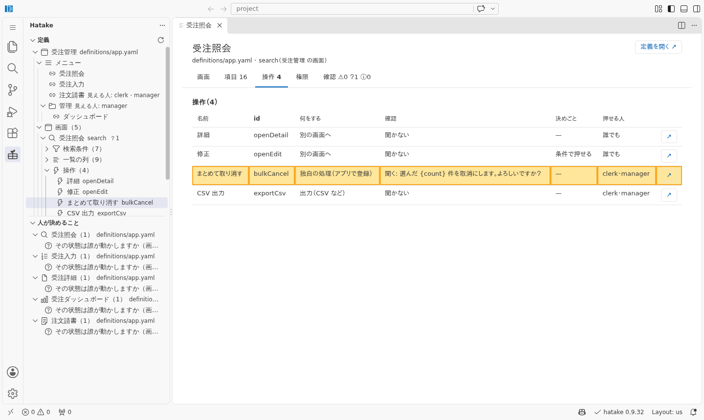

# 05. VS Code で確かめる（YAML を読まずに、AI が書いた定義を見る）

**目的**: AI が書いた定義（約420行）を、**YAML を読まずに**人が確かめる。見るのは
「業務として合っているか」だけ（書き方が正しいかは道具が見ている）。

使うのは hatake の VS Code 拡張（0.9.31〜）。**見るだけの道具**で、定義は書き換えません。
直すのは今までどおり AI に頼みます。

> この紙の画像は手で撮っていません。`bash tools/vscode-shots.sh apps/order-entry-prj` が
> 拡張機能を入れた VS Code（code-server）で受注入力の定義を開いて撮り、**撮れた中身を
> 案件の紙と突き合わせています**（「人が決めること」＝[残っている問い](../docs/2-設計/出力-残っている問い.txt)
> と同じか、など。食い違えば落ちる）。何を撮るかは [`tools/vscode-shots.json`](../tools/vscode-shots.json)。

## 入れる

[`hatake.version`](../../../hatake.version) と**同じ版**の `hatake-vscode-<版>.vsix` を
[Release](https://github.com/ASIL-E-Hatake/hatake/releases) から落として入れます。

```bash
code --install-extension hatake-vscode-0.9.32.vsix
```

`apps/order-entry-prj` を VS Code で開いて、左端の hatake の欄を押します。
版が違うと右下の状態バーが黄色になります（案件の版に合わせた `.vsix` を入れ直す）。

## 1. 何が作られたかを見る（ツリーと画面）

左の「定義」に、`definitions/app.yaml` の中身が**業務の言葉**で並びます。受注管理の下に
メニューと画面5枚。画面の横の `？1` は、その画面で人が決めることの数です。

「受注管理」を選ぶと、エディタの側に**動く画面**が開きます（データは定義から作った作り物）。



**見ること**: 頼んだ画面が揃っているか（受注照会・受注入力・受注詳細・ダッシュボード・注文請書）。
メニューの並びと名前が、現場で呼んでいる名前か。

## 2. 役割で見え方が変わるか（営業と課長）

画面のタブの「役割」を切り替えると、その役割の人に見えるメニューと画面になります。

| 営業（sales） | 課長（manager） |
|---|---|
|  |  |

営業には**注文請書と「管理」（ダッシュボード）が出ません**。一覧の「入力者」の列も出ません。
[案件の説明](../docs/1-要件定義/案件の説明.md)に書いた「誰が何を見るか」と合っているかを、
ここで確かめます。

> 見え方の確認だけです。**本当に止めているのはサーバ**（Java の API が同じ定義を読んで断る）。
> サーバ側は [API の試験](../docs/4-テスト/出力-APIテスト結果.md)が見ています。

## 3. 権限の表を見る（画面ごと）

ツリーで画面（「受注照会」）を選んで「権限」のタブ。役割を書いた所だけが表になります。



「入力者」の列・「まとめて取り消す」・「CSV 出力」は、営業事務（clerk）と課長だけ。
**表に出てこない所は誰にでも見える**ので、「営業にも見せたくないもの」が漏れていないかも見ます。

## 4. ボタンの振る舞いを見る（操作）

画面の下の「操作」から1つ選ぶと、「操作」のタブでその行が光ります。



何をするか・確認を出すか・押せる人が1行で読めます。「まとめて取り消す」は確認を出して、
押せるのは営業事務と課長。**AI が勝手に足したボタンが無いか**もここで見ます。

> **気づいたこと**: 「修正」の決めごとは「条件で押せる」とだけ出て、**どの条件か**
> （入力中・確定のときだけ）は出ません。「まとめて取り消す」の**1回の件数の上限**
> （`maxRows`。営業事務は 20 件）も表に出ません。どちらも人が確かめたい所なので、
> 枠組みに返しました（0.9.32 時点。今は「↗」で YAML のその行を見る）。

## 5. 人が決めることに答える（ここが本番）

左下の「人が決めること」に、**定義に書けないのに、決めていないと嘘になること**が並びます。
選ぶと「確認」のタブが開きます。


確認のタブの頭に「前書き: definitions/hatake.project.yaml（答え済みの問い 11 件はここに
出しません）」と出ます。採番・取消・端数・同時更新…の **11 件は前書きで答えてある**ので、
残っているのは1件（`state-owner`＝受注の状態は誰が動かすか）だけです。

**業務の判断なので、まだ答えていません**（[AI で作る道筋](../../../docs/AIで作る道筋.md#5-問いに答える人ここが本番)
の5段目）。答えるときは、前書きの `logic` に1行足して `answers: [state-owner]` を付けます。
足せば、このツリーからも消えます。

> **気づいたこと**: 同じ問いが**5画面すべての下に**並びます。きっかけは受注照会の
> 「修正は入力中・確定のときだけ押せる」だけで、ほかの画面には関係がありません
> （道具の紙も「order_search: 状態で出し分けている」と言っている）。拡張機能が画面ごとに
> 紙を作るときに、問いが画面で絞られていないため。枠組みに返しました（0.9.32 時点）。

## 0.9.31 で踏んだこと

拡張機能が入った 0.9.31 でこの案件を開いたら、「人が決めること」に **8 件**並びました。
拡張機能が前書きを読んでおらず、前書きで答えた問いがもう一度出ていたためです
（道具の紙は 1 件）。0.9.32 で、定義の隣の `hatake.project.yaml` を読むように直りました。

**人が見る道具が、AI が見る紙と違うことを言うのがいちばん困る**ので、撮影の道具は
「人が決めること」を案件の紙と突き合わせるようにしてあります。
