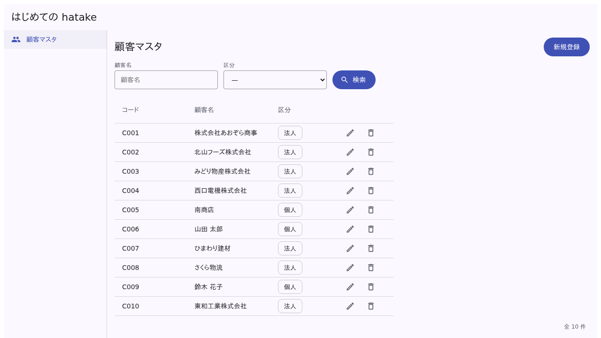
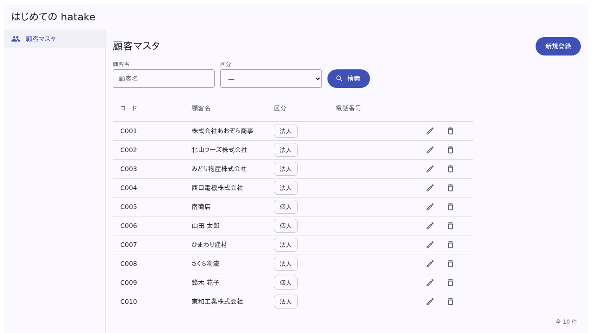
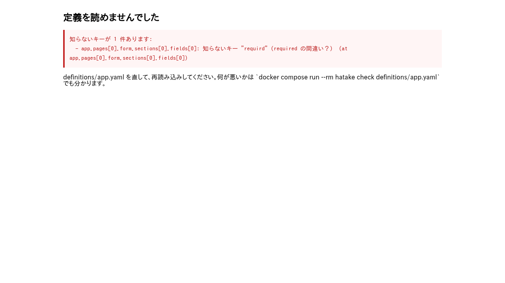

# はじめての hatake（30分サンプル）

顧客マスタ1画面だけの、いちばん小さい見本です。**30分で、hatake が何をするものかを
手で触って確かめる**ためのもの。要るのは Docker だけです（Node も Flutter も要りません）。

> ここで分かること: **画面のコードを1行も書かずに、定義（YAML）1枚で業務の画面が
> 動く**こと。定義を書き換えると画面が変わり、書き間違えると道具が理由を言うこと。
>
> ここで分からないこと: 本物のサーバ・DB・権限・帳票。それは
> [業務の見本](../../README.md#案件)（マスタメンテ・受注入力）にあります。



---

## 0〜5分: 動かす

```bash
docker compose up
```

<http://localhost:8090> を開くと、顧客マスタが出ます。検索・並べ替え・新規登録・編集・削除を
触ってみてください。全部動きます。

この画面のために書いたものは、[定義（`definitions/app.yaml`）](definitions/app.yaml)の 60 行
ほどだけです。画面のコード（Vue）は1行もありません。

> データは**ブラウザの中の作り物**です（サーバも DB もありません）。再読み込みすると最初の
> 10件に戻ります。

## 5〜10分: 定義を読む

[`definitions/app.yaml`](definitions/app.yaml) を開いてください。画面の部品と定義の対応は
こうなっています:

| 画面 | 定義 |
|---|---|
| 左のメニュー | `menu` |
| 検索欄（顧客名・区分） | `search.filters` |
| 一覧の列 | `table.columns`（`sortable: true` で見出しを押すと並ぶ） |
| 行の鉛筆とゴミ箱 | `table.rowActions` |
| 入力欄と必須の印 | `form.sections[].fields`（`required` / `validators`） |
| 「法人」「個人」 | `vocabularies`（列・検索欄・入力欄で同じものを名前で指す） |
| 右上の「新規登録」 | `actions` |

## 10〜15分: 列と入力欄を足す

電話番号を足してみます。`table.columns` の最後と `fields` の最後に1行ずつ足して、保存して、
**ブラウザを再読み込み**してください（作り直しは要りません）。

```yaml
      table:
        columns:
          # …（今ある3列の下に）
          - { field: phone, label: 電話番号, width: 140 }

      form:
        sections:
          - fields:
              # …（今ある3つの下に）
              - field: phone
                label: 電話番号
                type: text
                validators:
                  - { type: pattern, pattern: "^[0-9-]+$", message: 数字とハイフンで入れてください }
```

一覧に列が増え、新規登録の入力欄にも出ます。電話番号に字を入れて保存すると、書いた文で
止まります。



## 15〜20分: わざと書き間違える

`required: true` の1つを `requird: true` にして再読み込みしてください。画面の代わりに、
**どこを何と書き間違えたか**が出ます（黙って無視して、必須が効かない画面にはなりません）。



同じことは道具でも分かります。画面を開かなくても、書いた直後に確かめられます:

```bash
docker compose run --rm hatake check definitions/app.yaml
```

直したら、もう一度 `check` を通してください。今度は**4つの欄**が返ります:

| 欄 | 何が書いてあるか（この見本だと） |
|---|---|
| 事実（書いたのに効かない） | 警告はありません |
| 読み返し | 「検索＋一覧＋登録・修正・削除。条件 2、列 3 …」 |
| 好み（書いていないと不便かも） | 「『削除』は誰でも押せます（消したものは戻りません）」 |
| 人が決めること | 「同じ1件を2人が同時に直したら、どちらを残しますか」「番号は誰が付けますか」… |

最後の欄が hatake のいちばん大事な所です。**定義に書けないのに、決めていないと嘘になること**を
道具が問い返します。答えるのは人で、AI に決めさせてはいけません（[理由](../../docs/how-to-ask-ai.ja.md)）。

## 20〜25分: 読み返す（設計書の元）

```bash
docker compose run --rm hatake explain definitions/app.yaml --page customer_master
```

定義が**日本語の画面設計**になって返ります（抜粋。`--page` を外すと、アプリ全体の
メニューと画面の一覧になります）:

```
顧客マスタ（customer_master）— 検索して一覧に出し、その場で登録・修正・削除までできる画面

## 入力する項目
  ・コード … 必須、編集のときは直せない、10 文字以内
  ・顧客名 … 必須、60 文字以内
  ・区分 … 選択、必須、選べるのは 法人 / 個人
```

業務の見本では、ここから画面一覧・遷移図・権限表・画面設計書までを道具で作っています
（[受注入力の設計書](../order-entry-prj/docs/2-設計/)）。定義を直したら作り直すだけなので、
設計書が古くなりません。

## 25〜30分: AI に頼む

ここまで手で書いた定義は、本来 **AI が書くもの**です。[Claude Code](https://docs.anthropic.com/claude-code)
を使っているなら、このフォルダで開いて頼んでみてください。道具（MCP）は
[`.mcp.json`](.mcp.json) に書いてあるので、そのまま繋がります（Docker で動きます）。

```
顧客マスタに「取引開始日」を足して。日付で、任意。一覧にも出して、新しい順に並べられるように。
書いたら hatake_check を通して、人が決めることが出たら私に聞いて。
```

AI は定義を書き、`hatake_check` で自分で確かめ、問いが出たら聞いてきます。
**人の仕事は、問いに答えることです。**

---

## 次に読むもの

| | |
|---|---|
| [AI で業務システムを作る道筋](../../docs/AIで作る道筋.md) | 受注入力を例に、要件 → 頼み方 → 定義 → 設計書 → 試験 → 作ったあとの変更までを1本で辿る |
| [人が AI に何をするか](../../docs/how-to-ask-ai.ja.md) | 人が書く紙・答える問い・やってはいけないこと |
| [チュートリアル](https://github.com/ASIL-E-Hatake/hatake/blob/main/docs/tutorial.ja.md) | 0から受注入力画面まで（Flutter で） |

## 中身

| | |
|---|---|
| [`definitions/app.yaml`](definitions/app.yaml) | 定義（**これが画面のすべて**） |
| [`web/src/main.ts`](web/src/main.ts) | 定義を読んで Vue に渡すだけ（約 30 行。画面のコードではない） |
| [`web/src/customers.ts`](web/src/customers.ts) | 最初の10件（作り物） |
| [`docker-compose.yml`](docker-compose.yml) | 画面（:8090）と道具（`hatake`） |
| [`tests/smoke.mjs`](tests/smoke.mjs) | この README の手順が本当に動くかをブラウザで確かめる（絵もここで撮る） |

同じ定義は Flutter でも React でも描けます（[機能網羅](../kitchen-sink-prj/)で3つ並べています）。
ここで Vue にしているのは、ビルドが数秒で終わるからです。
