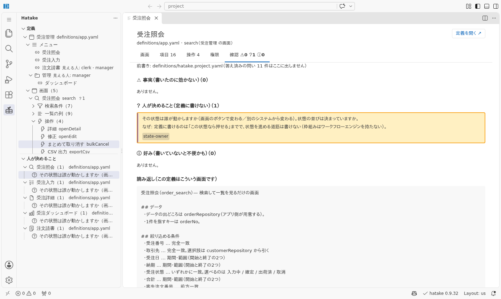

# AI で業務システムを作る道筋（受注入力を1本で辿る）

> **この紙の役目**: このリポジトリには、AI に業務システムを作らせた**実物の紙**が全部
> 残っています。ただ、あちこちに置いてあるので、初めての人は**どの順で読めばいいか**が
> 分かりません。この紙は、[受注入力](../apps/order-entry-prj/)を例に、その順番を1本に
> 並べたものです。
>
> まず手で触りたい人は先に [30分サンプル](../apps/starter-prj/) をどうぞ。

## 全体（9段）

| 段 | 誰が | 何をする | 見る紙 |
|---|---|---|---|
| 1 | 人 | 案件の説明を書く | [案件の説明](../apps/order-entry-prj/docs/1-要件定義/案件の説明.md) |
| 2 | AI | 枠組みの外を仕分ける | [仕分けの結果](../apps/order-entry-prj/docs/1-要件定義/出力-枠組みの外の仕分け.txt) |
| 3 | 人＋AI | 前書き（用語・決めごと）を育てる | [前書き](../apps/order-entry-prj/definitions/hatake.project.yaml) |
| 4 | AI | 定義を書いて、自分で確かめる | [定義](../apps/order-entry-prj/definitions/app.yaml)・[読み返しと助言](../apps/order-entry-prj/docs/2-設計/出力-読み返しと助言.txt) |
| 5 | **人** | 問いに答える | [残っている問い](../apps/order-entry-prj/docs/2-設計/出力-残っている問い.txt) |
| 6 | AI（道具） | 設計書を出す | [設計資料](../apps/order-entry-prj/docs/2-設計/) |
| 7 | AI | 画面とサーバに繋ぐ | [登録が要るもの](../apps/order-entry-prj/docs/3-実装/出力-登録が要るもの.txt) |
| 8 | AI（道具） | 試験して証跡を残す | [試験の記録](../apps/order-entry-prj/docs/4-テスト/) |
| 9 | 人＋AI | 作ったあとに変える | [変更に強いか](../apps/order-entry-prj/docs/まとめ/変更に強いか.md) |

**人の仕事は 1・3・5 の3か所です。** あとは AI と道具がやります。人に頼んだ依頼文は
[1本目の手順](../apps/master-maintenance-prj/手順/)にそのまま残してあります（2本目も同じ
流れで、違った所だけ[2本目の手順](../apps/order-entry-prj/手順/)に書きました）。

---

## 1. 案件の説明を書く（人）

普通の日本語で、知っていることを書くだけです。書式は要りません。いちばん大事なのは
**できないこと・やらないこと**（「単価は商品マスタの定価。取引先ごとの契約単価は今回やらない」）。
書いていないと、AI は書ける方に倒します。

→ [案件の説明](../apps/order-entry-prj/docs/1-要件定義/案件の説明.md)（61行）

## 2. 枠組みの外を仕分ける（AI）

頼んだことの中には、**定義に書けないもの**が混ざっています（認証・採番・締め処理・承認の流れ）。
AI に書き始めさせる前に、道具で仕分けます:

```bash
npx -p @hatake-fw/api hatake where --from docs/1-要件定義/案件の説明.md
```

「これは枠組みの外」と出たものは、定義には書かずに**サーバや別のシステムに置く**と決めます。
→ [仕分けの結果](../apps/order-entry-prj/docs/1-要件定義/出力-枠組みの外の仕分け.txt)

## 3. 前書きを育てる（人＋AI）

案件の**用語**（「受注番号は orderNo。注文番号とは呼ばない」）と**決めごと**を1枚に書きます。
下書きは AI が起こし、人が直します。定義を書く AI はこれを最初に読むので、用語の揺れと
名前の付け直しが起きなくなります。

→ [前書き](../apps/order-entry-prj/definitions/hatake.project.yaml)・
[依頼文](../apps/master-maintenance-prj/手順/02-前書きを育てる.md)

## 4. 定義を書かせる（AI）

ここで初めて画面を書かせます。AI は書いたら `hatake check` を通して、**書いたのに効かない所**
（綴り違い・紙に収まらない列）を自分で直します。

→ [定義（約420行）](../apps/order-entry-prj/definitions/app.yaml)・
[依頼文](../apps/master-maintenance-prj/手順/03-画面を書かせる.md)・
[道具が言ったこと](../apps/order-entry-prj/docs/2-設計/出力-読み返しと助言.txt)

## 5. 問いに答える（人・ここが本番）

道具は、**定義に書けないのに、決めていないと嘘になること**を問いにして返します（同時に直したら
どうするか・番号は誰が付けるか・消したものを残すか・端数は）。答えるのは人で、AI に決めさせては
いけません（当てると、誰も決めていない設計書が残る）。

受注入力では11件に答えて、前書きに書きました。**いま1件残っています**:

> [state-owner] その状態は誰が動かしますか。

修正ボタンを「入力中・確定のときだけ押せる」にしたので出た問いです。「入力中 → 確定」に
する手段が、画面にもサーバにもまだ無い。**業務の判断なので、答えていません。**
こういうものが紙に残り続けるのが、この道筋の狙いです。

→ [残っている問い](../apps/order-entry-prj/docs/2-設計/出力-残っている問い.txt)・
[依頼文](../apps/master-maintenance-prj/手順/04-問いに答える.md)

**YAML を読まずに見るなら VS Code 拡張**（0.9.31〜）。左の欄に定義が業務の言葉で並び、
「人が決めること」には前書きで答えていない問い（いまは `state-owner` の1件）だけが出ます。
役割を切り替えて「営業には何が見えるか」も、ここで確かめられます。



→ [VS Code で確かめる](../apps/order-entry-prj/手順/05-VSCodeで確かめる.md)（受注入力を開いて、人が見た順に）

## 6. 設計書を出す（道具）

画面一覧・遷移図・権限表・画面設計書・API 一覧は、**全部定義から作る生成物**です。手で書いて
いないので、定義を直したら作り直すだけで古くなりません（CI が `--check` で見ます）。

→ [設計資料](../apps/order-entry-prj/docs/2-設計/)・
[依頼文](../apps/master-maintenance-prj/手順/05-設計資料を作る.md)

## 7. 画面とサーバに繋ぐ（AI）

定義が外に要求しているもの（Repository・独自の処理・出す口）は道具が一覧にします。
AI はそれを見てアプリ側に登録し、サーバ（Java / Node）は**同じ定義を読んで**検証と権限を
かけます。

→ [登録が要るもの](../apps/order-entry-prj/docs/3-実装/出力-登録が要るもの.txt)・
[API を別の言語で書かせる](../apps/order-entry-prj/手順/03-APIを別の言語で書かせる.md)

## 8. 試験して証跡を残す（道具）

値の試験（`hatake run`＝画面を出さずに定義を動かす）・API の試験・画面のスクリーンショットを
回して、納品用の紙にします。都合の悪い結果も残します。

→ [試験の記録](../apps/order-entry-prj/docs/4-テスト/)・
[依頼文](../apps/master-maintenance-prj/手順/06-テストしてエビデンスを残す.md)

## 9. 作ったあとに変える（人＋AI）

業務は変わります。受注入力では、作ったあとに3つ（項目を足す・規則を変える・権限を変える）を
入れて、同じものを hatake 無しで作った版と比べました。差は行数より**同じことを書く場所の数**
（規則と権限は 1 か所 対 2〜3 か所）に出ました。

→ [変更に強いか](../apps/order-entry-prj/docs/まとめ/変更に強いか.md)

---

## まとめて読むなら

| | |
|---|---|
| [受注入力のまとめ](../apps/order-entry-prj/docs/まとめ/) | 導入を検討する人向け。工数の比較・人が作るべきもの・起きた問題 |
| [人が AI に何をするか](how-to-ask-ai.ja.md) | 人が書く紙・答える問い・やってはいけないこと |
| [Claude Code の設定](claude-code-setup.ja.md) | CLAUDE.md と道具（MCP）の繋ぎ方 |
